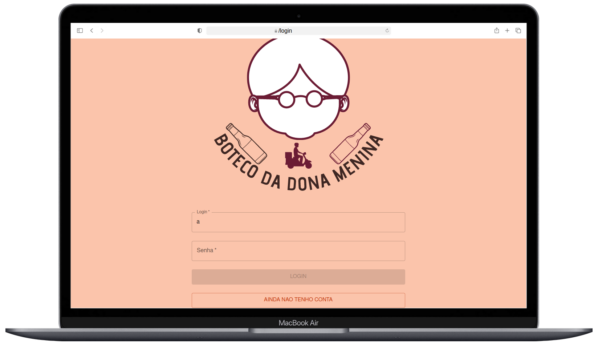
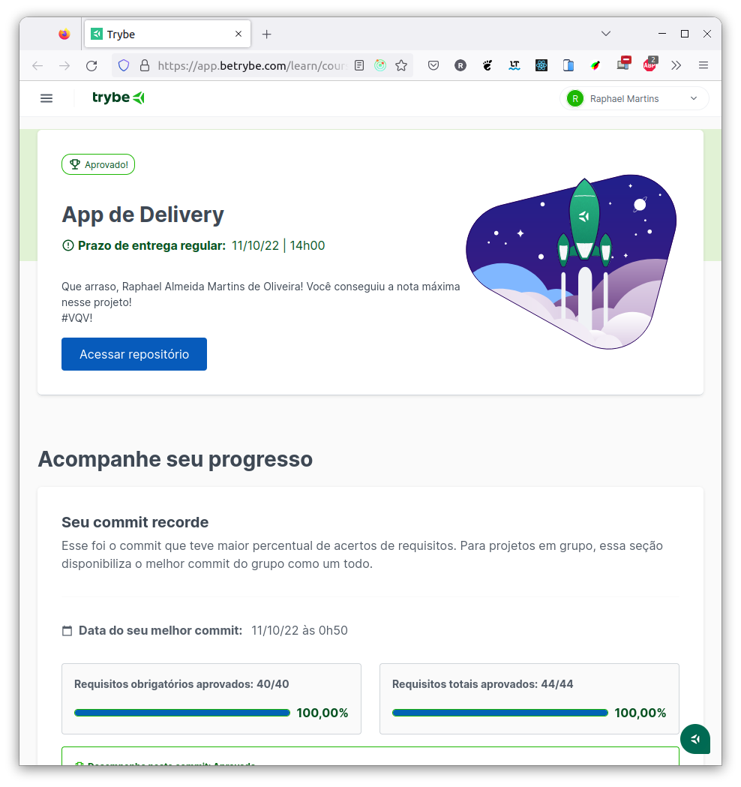

# :tropical_drink: Delivery App :motorcycle: :iphone:



## :page_with_curl: About/Sobre

<details>
  <summary markdown="span"><strong>:us: English</strong></summary><br />

Full stack React/Node.js group project developed by [Raphael Martins](https://www.linkedin.com/in/raphaelameidamartins/), [Arthur Teixeira](https://github.com/TuzinF5), [Helder Medeiros](https://github.com/helderme), [Rômulo Rodrigues](https://github.com/romulo-rp29) and [Sophia Contesini](https://github.com/sophiacontesini) at the end of Unit 31 ([Back-end Development Module](https://github.com/raphaelalmeidamartins/trybe_exercicios/tree/main/3_Desenvolvimento-Back-end)) of Trybe's Web Development course. We got approved with 100% of the mandatory and optional requirements met.

We had to develop both the Front-end and Back-end of a full stack application for a drink delivery app by using React, Node,js and Express.

**Note:** this project is still currently under development. I'll refactor all the code to use TypeScript and change the Front-end design entirely.
<br />
</details>

<details>
  <summary markdown="span"><strong>:brazil: Português</strong></summary><br />

Projeto full stack React/Node.js desenvolvido por [Raphael Martins](https://www.linkedin.com/in/raphaelameidamartins/), [Arthur Teixeira](https://github.com/TuzinF5), [Helder Medeiros](https://github.com/helderme), [Rômulo Rodrigues](https://github.com/romulo-rp29) e [Sophia Contesini](https://github.com/sophiacontesini) ao final do Bloco 31 ([Módulo Desenvolvimento Back-end](https://github.com/raphaelalmeidamartins/trybe_exercicios/tree/main/3_Desenvolvimento-Back-end)) do curso de Desenvolvimento Web da Trybe. Fomos aprovado com 100% dos requisitos obrigatórios e opcionais atingidos.

Tivemos que desenvolver tanto o Front-end, quanto o Back-end de uma aplicação full stack de aplicativo de entrega de bebidas. O front-end foi desenvolvido em React, enquanto o Back-end utiliza Node.js, Express.js e Sequelize.js.

**Observação**: este projeto atualmente se encontra em desenvolvimento. Pretendo refatorar o código inteiro para utilizar TypeScript e também mudarei completamente o design do Front-end.
<br />
</details>

## :man_technologist: Developed Skills/Habilidades Desenvolvidas

<details>
  <summary markdown="span"><strong>:us: English</strong></summary><br />

* Develop a Front-end application with React
* Create an Express.js application
* Create a RESTful API using MSC (Model-Service-Controller) architecture
* Validate requests' data with the Joi library
* Implement authentication with Json Web Token (JWT)
* Use the Sequelize.js ORM to connect with the database and perform queries
* Work in group using agile methodologies
<br />
</details>

<details>
  <summary markdown="span"><strong>:brazil: Português</strong></summary><br />

* Criar uma aplicação Front-end utilizando React
* Criar uma aplicação Express.js
* Criar uma API RESTful usando arquitetura MSC (Model-Service-Controller)
* Validar dados das requisições com a biblioteca Joi
* Implementar autenticação por Json Web Token (JWT)
* Usar o ORM Sequelize.js para fazer a conexão e queries no banco de dados
* Trabalhar em grupo utilizando metodologias ágeis
<br />
</details>

## :hammer_and_wrench: Tools/Ferramentas

* React
* Material UI
* Node.js
* Express.js
* Sequelize.js
* Json Web Tokens
* Joi
* Docker
* MySQL

## :hammer_and_wrench: Installation and execution/Instalação e execução

:construction: Em construção/Under development :construction:

<!-- <details>
  <summary markdown="span"><strong>:us: English</strong></summary><br />

To run this application you need to have **Git**, **Docker** and **Docker Compose** installed on your machine. Docker Compose needs to be at **1.29** version or superior.

### 1 - Clone the repository and enter the application folder
```sh
git clone git@github.com:raphaelalmeidamartins/mongodb-car-shop.git && cd mongodb-car-shop
```

### 2 - Run the containers by running the command below in the application folder
```sh
docker-compose up -d --buid
```

### 3 - Access the documentation and make requests to the server running on the port 3001

Access the route http://localhost:3001/docs/en to see the English documentation and try the API. If you prefer, you can use a HTTP requests client of your choice (Insomnia, Thunder Client, etc) to make requests.

<br />
</details>

<details>
  <summary markdown="span"><strong>:brazil: Português</strong></summary><br />

Para rodar está aplicação é necessário ter **Git**, **Docker** e o **Docker Compose** instalados no seu computador. O Docker Compose precisa estar na versão **1.29** ou superior.

### 1 - Clone o repositório e entre na pasta da aplicação
```sh
git clone git@github.com:raphaelalmeidamartins/mongodb-car-shop.git && cd mongodb-car-shop
```

### 2 - Rode os containers executando o comando abaixo na pasta raiz da aplicação
```sh
docker-compose up -d --build
```

### 3 - Acesse a documentação e faça requisições para o servidor aberto na porta 3001

Acesse a rota http://localhost:3001/docs/br para acessar a documentação em português e testar a API. Se preferir, utilize um cliente de requisições HTTP de sua preferência (Insomnia, Thunder Client, etc) para fazer as requisições.
<br />
</details> -->

## :trophy: Grade/Nota



<!-- Alterei alguma coisa -->